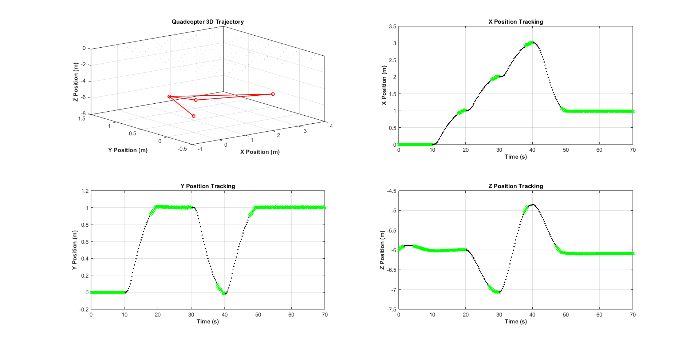

A quadcopter has 3 torques and 1 thrust that I need to regulate to keep in check 3 angles and 3 axis that the quadcopter moves in. The thrust represents how quickly the 4 motors spin and the torques is represented by the rotation of the quadcopter so it can move not only up and down, but also sideways.

==All of these things can be found on the real quadcopter== as well as my simulation. The only thing omitted from my simulation were external influences like wind.

As for the regulation, the only way to regulate using a state based regulation like the observer is to have the quadcopter in a mode where the angles are really small (because then we can say that sines of angles are equal to the angles themselves). Then it was only a matter of regulating the thrust and calculating the required angles from the x and y axis differences.

==It was a really interesting challenge that made things click for me in terms of real regulation.==

